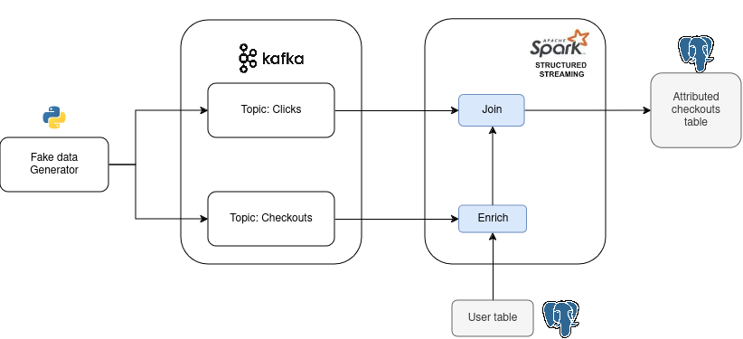

# First Click Attribution

On an e-commerce website, with every product purchased, there's a click led to this purchase.

The analysis team will need to analysis the information of  which click led to this purchase (attribution) 

 There are multiple types of **[attribution](https://www.shopify.com/blog/marketing-attribution#3)**; we will identify on `First Click Attribution`. 

Our objectives are:
 1. Enrich checkout data with the user name. The user data is in a transactional database.
 2. Identify which click leads to a checkout. For every product checkout, **the earliest click a user made on that product in the previous hour to be the click that led to a checkout** is chosen.
 3. Log the checkouts and their corresponding attributed clicks (if any) into a table.

## Architecture

Streaming pipeline architecture is as follows:

1. `Application`: Website generates clicks and checkout event data.
2. `Queue`: The clicks and checkout data are sent to their corresponding Kafka topics.
3. `Stream processing`: 
   1. Spark reads data from the Kafka topics.
   2. The click data is stored in our cluster state. Note that we only store click information for the last hour, and we only store one click per user-product combination. 
   3. The checkout data is enriched with user information by querying the user table in Postgres.
   4. The checkout data is left joined with the click data( in the cluster state) to see if the checkout can be attributed to a click.
   5. The enriched and attributed checkout data is logged into a Postgres sink table.

